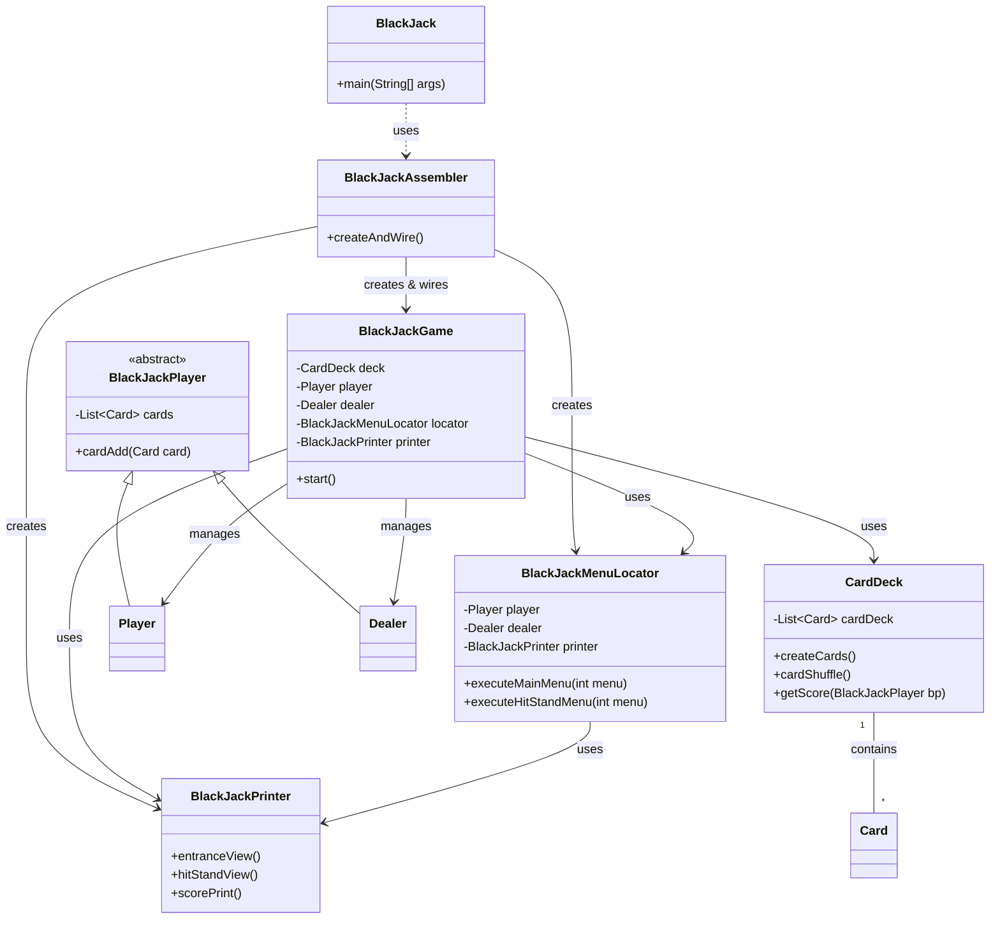

# 블랙잭(BlackJack) 카드 게임

Java를 활용하여 구현한 콘솔 기반의 블랙잭 게임 프로젝트입니다.


## 실행 방법

1.  **소스 코드 컴파일**
    ```bash
    javac src/*.java -d out/
    ```

2.  **프로젝트 실행**
    ```bash
    java -cp out/ BlackJack
    ```

---

## 프로젝트 구조



이 프로젝트는 객체 지향 설계를 토대로 구현되었습니다.

### `./src` 디렉토리
- `BlackJack.java`: 프로젝트의 엔트리 포인트 (Main Class).
- `BlackJackAssembler.java`: 객체 생성 및 상호 의존성 주입(Dependency Injection)을 담당.
- `BlackJackGame.java`: 전체적인 게임의 흐름(Main Loop)과 메뉴 상태를 제어.
- `BlackJackMenuLocator.java`: 플레이어의 입력에 따른 구체적인 실행 로직을 분기 및 처리.
- `BlackJackPrinter.java`: 콘솔 UI 출력(View 역할)을 전담.
- `Card.java` / `CardDeck.java`: 카드 및 덱의 데이터 구조와 비즈니스 로직.
- `Player.java` / `Dealer.java`: 게임 참가자의 상태(보유 카드, 초기화 등) 관리.

---

## 설계 포인트

### 1. Assembler 패턴을 통한 의존성 주입
`BlackJackAssembler` 클래스를 두어 객체 간의 조립을 담당하게 했습니다. 이는 각 클래스가 자신의 역할에만 집중할 수 있게 합니다.

### 2. 가독성을 고려한 View와 Logic의 분리 (MVC 지향)
- **Model**: `Card`, `Player`, `Dealer` 등 데이터와 도메인 로직.
- **View**: `BlackJackPrinter` 클래스가 모든 `System.out.println`과 같은 출력 로직을 전담합니다.
- **Controller**: `BlackJackGame`과 `BlackJackMenuLocator`가 사용자 입력을 받아 상태를 변경하고 작업을 지시합니다.

### 3. Locator를 활용한 메뉴 처리 로직 개선
`BlackJackMenuLocator`를 통해 복잡해질 수 있는 메뉴 분기 로직을 별도로 관리합니다. 게임의 핵심 루프(`BlackJackGame`)와 구체적인 실행 로직을 분리함으로써, 새로운 메뉴 요소를 추가하거나 변경할 때의 유연성을 확보했습니다.
